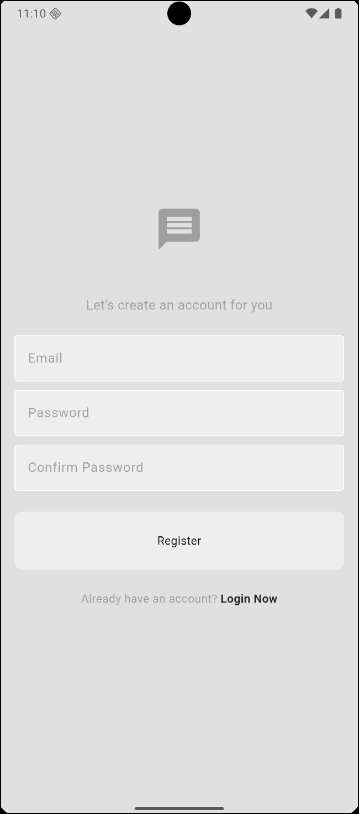
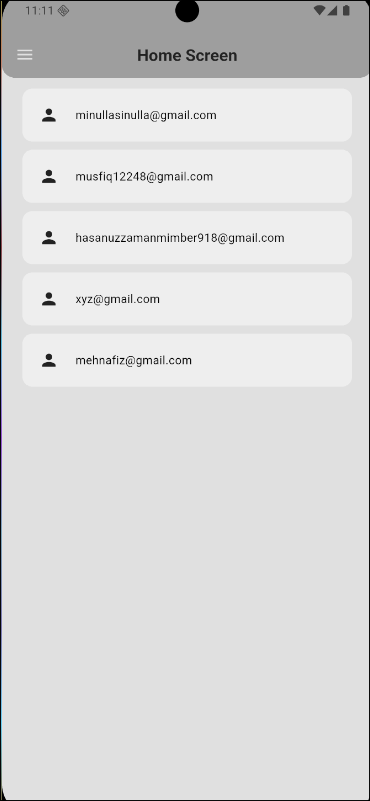
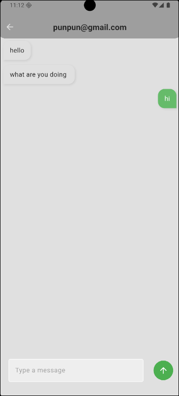
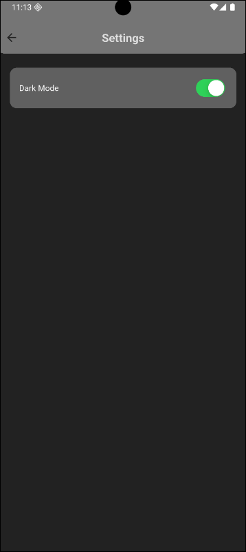

# 💬 Flutter Real-time Chat App

A modern, real-time messaging application built with Flutter and Firebase, featuring seamless authentication, instant messaging, and a beautiful dark/light theme interface.

## ✨ Features

- 🔐 **Firebase Authentication** - Secure user registration and login
- 💬 **Real-time Messaging** - Instant message delivery powered by Firestore
- 🌙 **Dark/Light Theme** - Toggle between beautiful themes
- 👥 **User Management** - Contact list and user profiles
- 📱 **Responsive Design** - Optimized for all screen sizes
- 🎨 **Modern UI** - Clean and intuitive user interface
- 🔒 **Secure** - Firebase security rules implementation

## 📱 Screenshots

### Authentication Flow
<p align="center">
  
  
</p>

### Main App Interface
<p align="center">
  
  
</p>

### Navigation & Settings
<p align="center">
  
  
</p>

## 🛠️ Tech Stack

- **Frontend**: Flutter (Dart)
- **Backend**: Firebase
- **Database**: Cloud Firestore
- **Authentication**: Firebase Auth
- **State Management**: Provider
- **Icons**: Cupertino Icons

## 📦 Dependencies

```yaml
dependencies:
  flutter:
    sdk: flutter
  cupertino_icons: ^1.0.8
  firebase_core: ^4.0.0
  firebase_auth: ^6.0.1
  email_validator: ^3.0.0
  cloud_firestore: ^6.0.0
  provider: ^6.1.5+1
```

## 🚀 Getting Started

### Prerequisites

- Flutter SDK (latest stable version)
- Dart SDK
- Android Studio / VS Code
- Firebase project setup

### Installation

1. **Clone the repository**
   ```bash
   git clone https://github.com/OnoPUNPUN/chat_app.git
   cd flutter-chat_app
   ```

2. **Install dependencies**
   ```bash
   flutter pub get
   ```

3. **Firebase Setup**
   - Create a new Firebase project at [Firebase Console](https://console.firebase.google.com/)
   - Enable Authentication (Email/Password)
   - Create a Firestore database
   - Download and add configuration files:
     - `android/app/google-services.json` (Android)
     - `ios/Runner/GoogleService-Info.plist` (iOS)

4. **Configure Firebase**
   ```bash
   flutter packages pub run build_runner build
   ```

5. **Run the app**
   ```bash
   flutter run
   ```

## 🏗️ Project Structure

```
lib/
├── main.dart                 # App entry point
├── models/                   # Data models
│   └── message.dart         # Message data model
├── screens/                  # UI screens
│   ├── chat_screen.dart     # Chat interface
│   ├── home_screen.dart     # Contact list/home
│   ├── login_screen.dart    # User login
│   ├── register_screen.dart # User registration
│   └── settings_screen.dart # App settings
├── services/                 # Firebase services
│   ├── auth/                # Authentication services
│   │   ├── auth_gate.dart   # Authentication guard
│   │   ├── auth_service.dart # Auth logic
│   │   ├── error_handler.dart # Error management
│   │   └── login_or_register.dart # Auth flow
│   └── chat/                # Chat services
│       └── chat_service.dart # Chat functionality
├── themes/                   # App theming
│   ├── dark_mode.dart       # Dark theme
│   ├── light_mode.dart      # Light theme
│   └── theme_provider.dart  # Theme state management
├── widgets/                  # Reusable widgets
│   ├── chat_bubble.dart     # Message bubbles
│   ├── my_button.dart       # Custom buttons
│   ├── my_drawer.dart       # Navigation drawer
│   ├── my_textfield.dart    # Custom text inputs
│   ├── user_tile.dart       # User list items
│   └── firebase_options.dart # Firebase configuration
└── firebase_options.dart    # Firebase setup
```

## 🔥 Firebase Configuration

### Firestore Rules
```javascript
rules_version = '2';

service cloud.firestore {
  match /databases/{database}/documents {
    match /{document=**} {
      allow read, write: if request.time < timestamp.date(2025, 9, 22);
    }
  }
}
```

### Authentication Setup
- Enable Email/Password authentication in Firebase Console
- Configure sign-in methods as needed

## 🎯 Key Features Implementation

### Real-time Messaging
```dart
Stream<QuerySnapshot> getMessage(String userID, otherUserID) {
    // construct a chatroom ID for two users
    List<String> ids = [userID, otherUserID];
    ids.sort();
    String chatRoomID = ids.join('_');

    return _firestore
        .collection("chat_rooms")
        .doc(chatRoomID)
        .collection("message")
        .orderBy("timestamp", descending: false)
        .snapshots();
  }
```

### State Management with Provider
```dart
ChangeNotifierProvider(
  create: (context) => AuthProvider(),
  child: Consumer<AuthProvider>(
    builder: (context, auth, child) {
      return MaterialApp(/* App configuration */);
    },
  ),
);
```

## 🔧 Available Scripts

```bash
# Run the app in debug mode
flutter run

# Build APK for Android
flutter build apk

# Build iOS app
flutter build ios

# Run tests
flutter test

# Analyze code
flutter analyze
```

## 📱 Platform Support

- ✅ Android
- ✅ iOS
- ✅ Web (with additional configuration)

## 🤝 Contributing

Contributions are welcome! Please feel free to submit a Pull Request.

1. Fork the project
2. Create your feature branch (`git checkout -b feature/AmazingFeature`)
3. Commit your changes (`git commit -m 'Add some AmazingFeature'`)
4. Push to the branch (`git push origin feature/AmazingFeature`)
5. Open a Pull Request

## 📄 License

This project is licensed under the MIT License - see the [LICENSE](LICENSE) file for details.

## 🙏 Acknowledgments

- Flutter team for the amazing framework
- Firebase for backend services
- Icons by Cupertino Icons
- Community contributors

## 📞 Contact

Your Name - [@OnoPUNPUN](punpunonodera754@gmail.com)

Project Link: [Chat App](https://github.com/OnoPUNPUN/chat_app.git)

---

⭐ **Star this repo if you found it helpful!** ⭐